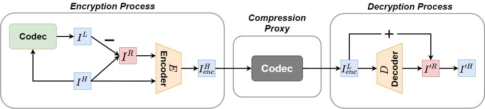

# Learning to Hide Residual for Boosting Image Compression (BMVC 2021)
Official PyTorch implementaton of ICRA 2020 paper "[Learning Face Recognition Unsupervisedly by Disentanglement and Self-Augmentation](https://www.bmvc2021-virtualconference.com/assets/papers/0012.pdf)".  
You can visit our project website [here](https://yilunlee.github.io/hiding_residual/).

## Introduction
Lossy compression usually leads to severe compression artifacts, such as blocking boundary, mosquito noise, and blur. Reducing compression artifacts is essential for better visual experience and quality when transmitting data under limited bandwidth, where the sender compresses an image and transmits it via a communication channel to the receiver side. To tackle this problem, most existing methods aim to directly recover details from received compressed image, instead of fully exploiting the rich information contained in the uncompressed image. In this paper, we focus on leveraging the residual information, i.e. the difference between a compressed image and its corresponding original/uncompressed one, and propose to hide the residual into the original image by a novel framework. As such, our model that considers this resultant image with the hidden information has a better ability to recover the residual caused by the compression process. Afterwards, the hidden residual could be decoded from the received image and used to boost the quality of image reconstruction on the receiver side. Extensive experiments verify the efficacy of our proposed framework in reducing compression artifacts and showing favorable performance against numerous baselines.

<div align="center">
  
</div>
<div align="center">
  
</div>

## Usage
### Enviroment
#### Prerequisites
#### Other requirements
```

```

### Prepare Dataset


### Evaluation
```
 
```

### Train
1. 
```

```


## Citation
If you find this work useful for your research, please cite:
```Bibtex
@inproceedings{lee2021bmvc,
 title = {Learning to Hide Residual for Boosting Image Compression},
 author = {Yi-Lun Lee and Yen-Chung Chen and Min-Yuan Tseng and Yi-Hsuan Tsai and Wei-Chen Chiu},
 booktitle = {British Machine Vision Conference (BMVC)},
 year = {2021}
}
```

